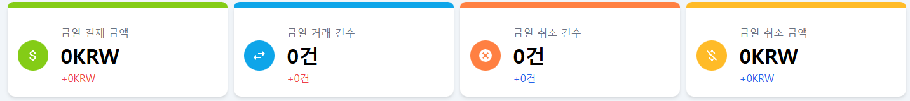
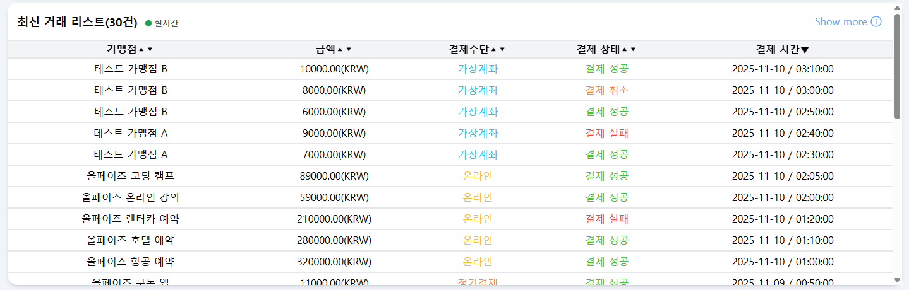
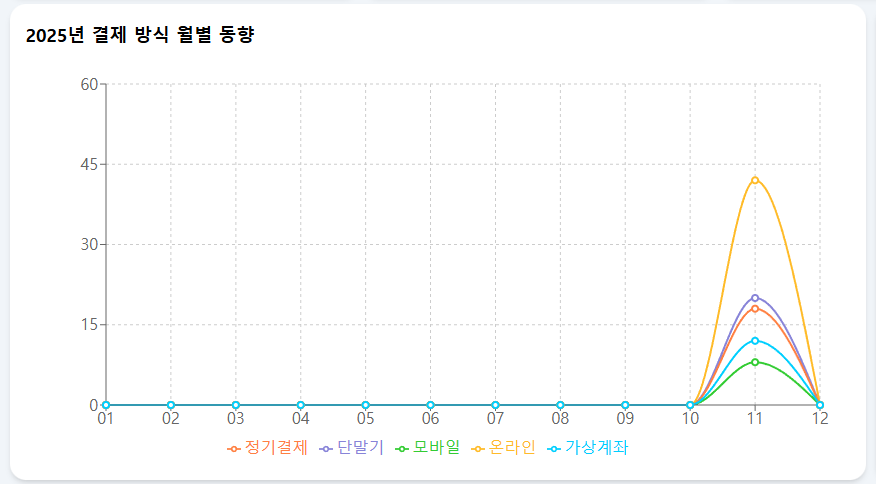
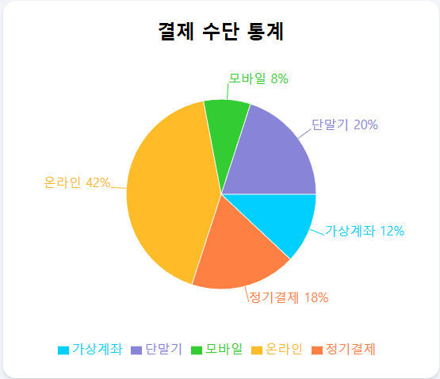
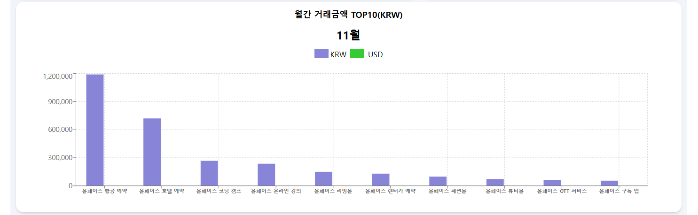
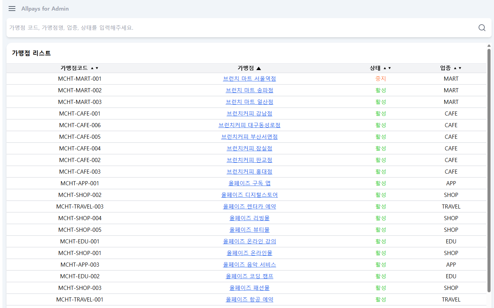
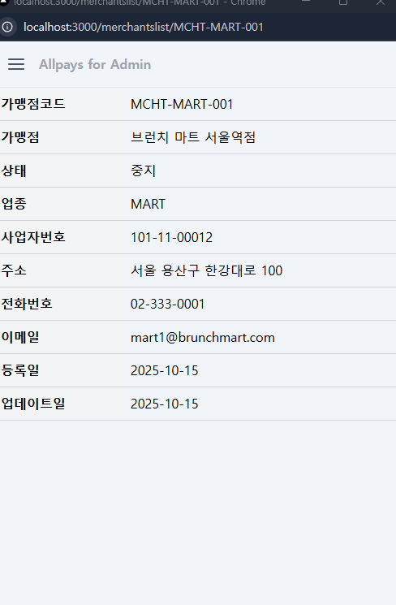
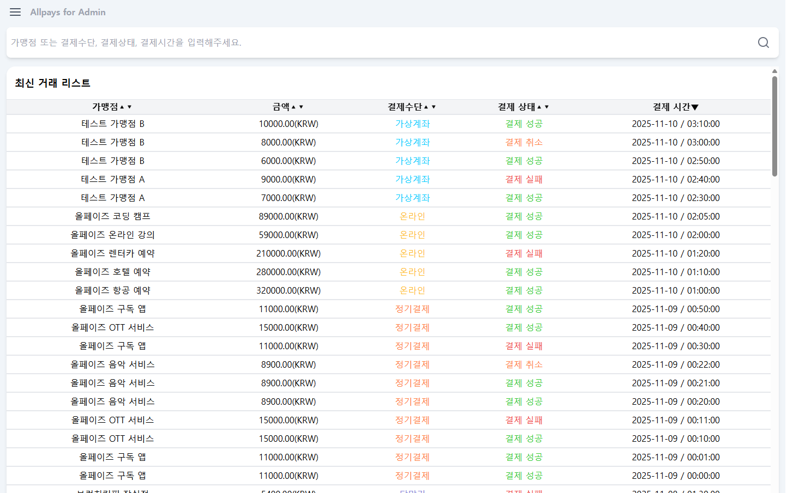

# AllPays 과제 전형 프로젝트

Developer : Park Jin hyeok  
Date : 2025-11-17 ~ 2025-11-21  
Decription : PG사 대쉬보드 메인화면 구현 및 결제 리스트 화면 구현  
Tech:

- React 18
- Next.js 14.2.30
- TypeScript
- Tailwind CSS 3.4.1
- React Query 5.90.10
- axios 1.13

UI Library :

- dyajs 1.11.19
- react-bugger-menu 3.1
- react-icon 1.0
- react-icons 5.5
- react-pro-sidebar 1.1
- recharts 3.4

## .env 환경변수 설정

```
Project root > .env

NEXT_PUBLIC_BASE_URL=https://recruit.paysbypays.com/
```

## Getting Started

```bash
npm install

npm run dev
```

## Design

### 대시보드 상단 카드 컴포넌트(직접구현)



- 금일 결제 금액 , 금일 거래 건수와 같은 데이터 수집에 목적성을 두었습니다.
- 최하단의 통계를 통해 전날 대비 증가량 / 감소량을 한눈에 파악할 수 있도록 설계 하였습니다.
- 가장많이 접하게 되는 대쉬보드 페이지 내부의 컴포넌트임으로 가시성 , 눈 피로감에 초점을 맞추어 컬러 설정

### 대시보드 하단 리스트 컴포넌트(직접구현)



- 최신 거래 리스트 30건을 실시간 조회하여 부가적인 페이지 이동 없이 최신의 데이터를 바로 조회할 수 있음에 목적성을 두고 설계하였습니다.
- 각 항목별 오름차순 내림차순 정렬을 통해 원하는 조건의 데이터를 편하게 조회할 수 있도록 하였습니다.
- ReactQuery 의 staleTime 와 refetchInterval을 통해 짧은 시간으로 데이터 갱신을 할 수 있도록 하였습니다.
- 상단의 실시간 표시를 통해 서버의 health 상태를 파악할 수 있습니다.

### 대시보드 중앙부 선형 차트 컴포넌트(recharts 사용)



- 매년도 결제방식 통계를 월별로 나누어 분기별 결제방식 트렌트를 파악할 수 있도록 설계 하였습니다.
- 차트를 통해서 분기별 결제방식 데이터를 통계내어 시기별 많이 사용되는 결제방식 데이터를 추출할 수 있음에 목적성을 두고 설계 하였습니다.

### 대시보드 중앙부 원형 차트 컴포넌트(recharts 사용)



- 전체 거래 리스트에서 결제방식을 100분율로 나누어 높은 결제 비율을 파악할 수 있도록 설계 하였습니다.
- 원형 차트 좌측의 선형 차트와 결제방식 컬러를 동일하게 선정하여 가시성을 향상 시켰습니다.

### 대시보드 중앙하단부 막대 차트 컴포넌트(recharts 사용)



- 당월 거래금액이 높은 가맹점을 좌측에서 우측으로 통화별로 나누어 상위 10개의 막대 차트로 구현하였습니다.
- 거래금액이 높은 10개의 가맹점을 막대 그래프를 통해 리스트보다 시각적으로 파악하기 쉽게 할 수 있도록 설계 하였습니다.

### 가맹점 조회 리스트 컴포넌트(직접구현)



- 모든 가맹점 리스트를 볼 수 있습니다.
- 대시보드 하단 리스트 컴포넌트와 동일하게 항목별 정렬을 통해 정렬이 가능합니다.
- 상단의 검색 컴포넌트를 통하여 가맹점코드, 가맹점명 , 업종 , 상태로 조회가 가능합니다.
- 가맹점 클릭시 가맹점 상세 정보를 별도의 창으로 조회 가능합니다.

### 가맹점 조회 리스트 컴포넌트(직접구현)



- 가맹점 상세 정보를 파악할 수 있습니다.
- 기존 페이지 이동이 아닌 별도의 새창을 띄워 업무 중 상세 정보를 띄운 채로 페이지 이동이 가능하게 하여 효율성이 높게 설계하였습니다.

### 최신거래리스트 거래리스트 컴포넌트(직접 구현)



- 가맹점 조회 리스트 페이지의 검색 컴포넌트와 동일하게 가맹점 , 금액 , 결제수단 , 결제상태 , 결제시간으로 검색 조회가 가능합니다.
- 가맹점 조회 리스트 페이지와 동일하게 오름차순 내림차순 필터링을 통해서 조회가 가능합니다.
